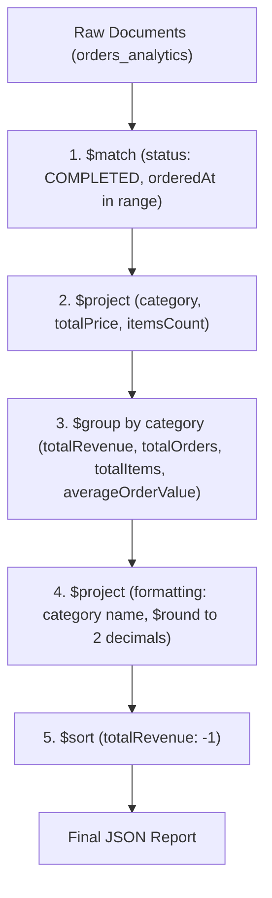

# 📊 InsightPulse — Reporting Engine (`insight-pulse-service`)

A high-performance analytical reporting microservice built with **NestJS**, **MongoDB 7.0**, and **Mongoose ODM**. This project is designed for hands-on mastery of the **MongoDB Aggregation Pipeline**, query optimization using compound indexes, and containerized NoSQL infrastructure via **Docker**.

---

## 🚀 Key Objectives

- Deploy an isolated, reliable NoSQL environment featuring **MongoDB 7.0** and **Mongo Express** web interface on a custom Docker network.
- Build fast and optimized analytical reports using the **Aggregation Pipeline** (`$match`, `$project`, `$group`, `$sort`, `$round` stages).
- Implement and verify **Compound Indexes** for efficient filtering and sorting over time-series and categorical data.
- Handle high-volume data sets (seeding 10,000+ realistic orders) while considering memory thresholds (`allowDiskUse`).

---

## 🛠️ Tech Stack

| Area | Technology | Purpose |
| :--- | :--- | :--- |
| **Backend Framework** | [NestJS](https://nestjs.com/) (Node.js / TypeScript) | Modular server architecture, Dependency Injection |
| **Database** | [MongoDB 7.0](https://www.mongodb.com/) | Document-oriented NoSQL database |
| **ODM** | [Mongoose](https://mongoosejs.com/) (`@nestjs/mongoose`) | Schema design, type safety, and aggregation pipeline builder |
| **Infrastructure** | [Docker](https://www.docker.com/) & Docker Compose | Containerized database and web administration panel |
| **Admin UI** | [Mongo Express](https://github.com/mongo-express/mongo-express) | Web-based MongoDB management interface |
| **Validation** | `class-validator`, `class-transformer` | Strict typing and validation of incoming DTOs |

---

## 📁 Project Structure

```text
insight-pulse-service/
├── .agents/                    # Assistant rules and workspace configuration
├── docs/                       # Step-by-step specifications and learning roadmap
│   └── task_1.md               # Task 1 (Docker Setup) & Task 2 (Aggregation Pipeline)
├── src/                        # NestJS source code
│   ├── analytics/              # Analytics module
│   │   ├── dto/                # Data Transfer Objects (DateRangeDto)
│   │   ├── schemas/            # Mongoose document schemas (OrderAnalytics)
│   │   ├── analytics.controller.ts
│   │   ├── analytics.service.ts
│   │   └── analytics.module.ts
│   ├── app.module.ts           # Root application module
│   └── main.ts                 # Application entrypoint
├── docker-compose.mongo.yml     # Multi-container MongoDB & Mongo Express setup
├── .env                        # Local environment variables
├── .env.example                # Template for environment variables
├── package.json
└── README.md
```

---

## 🐳 Infrastructure (Docker)

The project includes `docker-compose.mongo.yml` defining two core services:

1. **`mongo_db`**:
   - Image: `mongo:7.0`
   - Ports: `27017:27017`
   - Volume: `mongo_analytics_data` mounted to `/data/db` for persistent storage
   - Healthcheck: automated verification using `mongosh ping` command
2. **`mongo_express`**:
   - Image: `mongo-express:latest`
   - Ports: `8081:8081` (UI accessible at `http://localhost:8081`)
   - Dependency: `depends_on` with `condition: service_healthy` for `mongo_db`

Network: `analytics_network` (custom bridge).

---

## 📄 Data Schema (`OrderAnalytics`)

The `orders_analytics` collection stores denormalized order records for reporting:

```typescript
{
  orderId: string;       // Unique identifier (UUID v4)
  customerId: string;    // Customer ID (indexed)
  category: string;      // Product category ('Tech' | 'Home' | 'Fashion' | 'Auto') (indexed)
  totalPrice: number;    // Total order price
  itemsCount: number;    // Quantity of items purchased
  status: string;        // Order status ('COMPLETED' | 'REFUNDED' | 'CANCELLED')
  orderedAt: Date;       // Timestamp when order was placed (indexed)
}
```

### ⚡ Indexing & Query Optimization
A compound index is defined to accelerate analytics queries:
```typescript
OrderAnalyticsSchema.index({ status: 1, orderedAt: -1 });
```
> **Why is this important?** The primary stage of our analytical pipeline filters completed orders within a specific date range (`startDate` to `endDate`). This compound index enables an Index Scan (**IXSCAN**) rather than a Collection Scan (**COLLSCAN**), dramatically reducing query execution time and memory usage.

---

## 🔄 Aggregation Pipeline Workflow

The category revenue report (`getCategoryRevenueReport`) is executed as a multi-stage pipeline:



1. **`$match`**: Filters out non-completed orders and items outside the specified date range (uses `{ status: 1, orderedAt: -1 }` index).
2. **`$project`**: Selects only necessary fields to reduce working set size in memory.
3. **`$group`**:
   - Groups by `_id: '$category'`.
   - `totalRevenue`: accumulated sum of `totalPrice`.
   - `totalOrders`: order count (`{ $sum: 1 }`).
   - `totalItems`: total items sold (`$sum: '$itemsCount'`).
   - `averageOrderValue`: calculated average (`$avg: '$totalPrice'`).
4. **`$project`**: Formats output fields (aliases `_id` to `category`, rounds `averageOrderValue` to 2 decimal places using `$round`).
5. **`$sort`**: Sorts resulting categories by revenue in descending order (`totalRevenue: -1`).

---

## 🌐 API Endpoints

### Category Revenue Report
```http
GET /analytics/categories?startDate=2026-07-01&endDate=2026-09-01
```

**Query Parameters (`DateRangeDto`):**
- `startDate` (ISO 8601 string, required) — Start of reporting window.
- `endDate` (ISO 8601 string, required) — End of reporting window.

**Sample Response (200 OK):**
```json
[
  {
    "category": "Tech",
    "totalRevenue": 142500.50,
    "totalOrders": 320,
    "totalItems": 580,
    "averageOrderValue": 445.31
  },
  {
    "category": "Home",
    "totalRevenue": 89400.00,
    "totalOrders": 210,
    "totalItems": 430,
    "averageOrderValue": 425.71
  }
]
```

---

## ⚡ Quick Start

### 1. Environment Configuration
Copy the sample environment file and configure variables:
```bash
cp .env.example .env
```

### 2. Launch Infrastructure (MongoDB + Mongo Express)
```bash
docker compose -f docker-compose.mongo.yml up -d
```
- Access Mongo Express UI: [http://localhost:8081](http://localhost:8081)

### 3. Install Dependencies & Start Application
```bash
npm install
npm run start:dev
```

### 4. Seed Test Data
Populate the database with 10,000 realistic orders to benchmark aggregation performance:
```bash
npm run seed:analytics
```

---

## 📚 Task References
- [docs/task_1.md](file:///home/bohdan/MyProjects/test_projects/insight-pulse-service/docs/task_1.md):
  - **Task 1**: Docker Environment Setup (`docker-compose.mongo.yml`).
  - **Task 2**: Basic Aggregation Pipeline in NestJS (`OrderAnalytics` schema, Seeding script, Controller).
