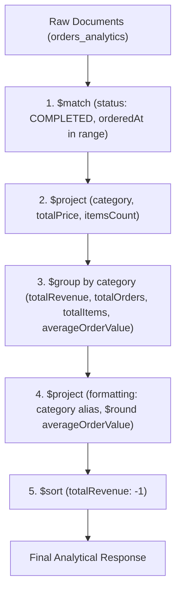

# 📊 InsightPulse — Reporting Engine (`insight-pulse-service`)

A high-performance analytical reporting microservice built with **NestJS** (ESM), **MongoDB 7.0**, and **Mongoose ODM**. This project is designed for hands-on mastery of the **MongoDB Aggregation Pipeline**, query optimization using compound indexes, and containerized NoSQL infrastructure via **Docker**.

---

## 🚀 Key Objectives

- **Containerized Infrastructure**: Run an isolated NoSQL environment with **MongoDB 7.0** and **Mongo Express** web interface on a custom Docker bridge network.
- **Aggregation Pipelines**: Build optimized analytical queries using multi-stage pipelines (`$match`, `$project`, `$group`, `$sort`, `$round`).
- **Compound Indexes**: Optimize time-series and categorical queries with `{ status: 1, orderedAt: -1 }` index to prevent full collection scans (`COLLSCAN`).
- **High-Volume Data Processing**: Seed and analyze 10,000+ realistic order records while considering pipeline memory thresholds (`allowDiskUse`).

---

## 🛠️ Tech Stack

| Area | Technology | Purpose |
| :--- | :--- | :--- |
| **Backend Framework** | [NestJS](https://nestjs.com/) (v12, ES Modules) | Modular architecture, Dependency Injection |
| **Language & Runtime** | [Node.js](https://nodejs.org/) & [TypeScript](https://www.typescriptlang.org/) | Type-safe server implementation |
| **Database** | [MongoDB 7.0](https://www.mongodb.com/) | Document-oriented NoSQL database |
| **ODM** | [Mongoose](https://mongoosejs.com/) (`@nestjs/mongoose`) | Data modeling, validation, and pipeline builder |
| **Infrastructure** | [Docker](https://www.docker.com/) & Docker Compose | Containerized database and web administration tools |
| **Admin UI** | [Mongo Express](https://github.com/mongo-express/mongo-express) | Web dashboard for visual inspection of collections |
| **Testing & Linting** | [Vitest](https://vitest.dev/) & [Oxlint](https://oxc.rs/) | Fast unit/e2e testing and code analysis |
| **Validation** | `class-validator`, `class-transformer` | Strict typing and validation for query DTOs |

---

## 📁 Project Structure

```text
insight-pulse-service/
├── .agents/                    # Assistant rules and workspace configuration
├── docs/                       # Step-by-step specifications and learning roadmap
│   └── task_1.md               # Task 1 (Docker Setup) & Task 2 (Aggregation Pipeline)
├── src/                        # Application source code
│   ├── analytics/              # Analytics module
│   │   ├── dto/                # Data Transfer Objects (DateRangeDto)
│   │   ├── schemas/            # Mongoose schemas (OrderAnalytics)
│   │   ├── analytics.controller.ts
│   │   ├── analytics.service.ts
│   │   └── analytics.module.ts
│   ├── app.controller.ts
│   ├── app.module.ts           # Root module (Mongoose & Config integration)
│   ├── app.service.ts
│   └── main.ts                 # Application bootstrap entrypoint
├── test/                       # E2E test suites
├── docker-compose.yml          # MongoDB & Mongo Express containers
├── .env                        # Local environment variables (ignored in git)
├── .env.example                # Sample environment template
├── package.json
└── README.md
```

---

## 🐳 Infrastructure (Docker)

The project includes `docker-compose.yml` defining two interdependent services:

1. **`mongo_db`**:
   - Image: `mongo:7.0`
   - Container Name: `mongo_db`
   - Ports: `27017:27017`
   - Volume: `mongo_analytics_data` mounted to `/data/db` for persistent storage
   - Healthcheck: automated verification using `mongosh ping` command
2. **`mongo_express`**:
   - Image: `mongo-express:latest`
   - Container Name: `mongo_express`
   - Ports: `8081:8081` (UI accessible at `http://localhost:8081`)
   - Dependencies: `depends_on` with `condition: service_healthy` for `mongo_db`

Network: `analytics_network` (bridge).

---

## 📄 Data Schema (`OrderAnalytics`)

The `orders_analytics` collection stores denormalized order records for reporting:

```typescript
{
  orderId: string;       // Unique order identifier (UUID v4)
  customerId: string;    // Customer identifier (indexed)
  category: string;      // Product category ('Tech' | 'Home' | 'Fashion' | 'Auto') (indexed)
  totalPrice: number;    // Total order monetary value
  itemsCount: number;    // Quantity of items purchased
  status: string;        // Order status ('COMPLETED' | 'REFUNDED' | 'CANCELLED')
  orderedAt: Date;       // Creation timestamp (indexed)
}
```

### ⚡ Compound Indexing Strategy
```typescript
OrderAnalyticsSchema.index({ status: 1, orderedAt: -1 });
```
> **Performance Note**: The primary aggregation stage filters completed orders within a specific date range (`startDate` to `endDate`). This compound index allows MongoDB to perform an **Index Scan (IXSCAN)** rather than scanning every document in the collection (**COLLSCAN**).

---

## 🔄 Aggregation Pipeline Workflow

The category revenue report (`getCategoryRevenueReport`) executes as a multi-stage aggregation pipeline:



1. **`$match`**: Filters completed orders within the specified date range.
2. **`$project`**: Prunes unnecessary fields to minimize RAM usage in subsequent stages.
3. **`$group`**:
   - `_id: '$category'`
   - `totalRevenue`: `{ $sum: '$totalPrice' }`
   - `totalOrders`: `{ $sum: 1 }`
   - `totalItems`: `{ $sum: '$itemsCount' }`
   - `averageOrderValue`: `{ $avg: '$totalPrice' }`
4. **`$project`**: Formats output (aliases `_id` to `category`, rounds `averageOrderValue` to 2 decimal places using `$round`).
5. **`$sort`**: Orders results by `totalRevenue` in descending order (`-1`).

---

## 🌐 API Specification

### Category Revenue Report
```http
GET /analytics/categories?startDate=2026-07-01&endDate=2026-09-01
```

**Query Parameters (`DateRangeDto`):**
- `startDate` (ISO 8601 string, required) — Start date of the analytical period.
- `endDate` (ISO 8601 string, required) — End date of the analytical period.

**Sample Response (200 OK):**
```json
[
  {
    "category": "Tech",
    "totalRevenue": 142500.50,
    "totalOrders": 320,
    "totalItems": 580,
    "averageOrderValue": 445.31
  },
  {
    "category": "Home",
    "totalRevenue": 89400.00,
    "totalOrders": 210,
    "totalItems": 430,
    "averageOrderValue": 425.71
  }
]
```

---

## ⚡ Quick Start

### 1. Environment Setup
Create your local environment file:
```bash
cp .env.example .env
```

### 2. Start Infrastructure
Run MongoDB and Mongo Express in detached mode:
```bash
docker compose up -d
```
- Access Mongo Express Web UI: [http://localhost:8081](http://localhost:8081)

### 3. Install Application Dependencies
```bash
npm install
```

### 4. Run the Application
```bash
# Development mode with hot-reload
npm run start:dev

# Production build & run
npm run build
npm run start:prod
```

### 5. Running Tests & Linting
```bash
# Run unit tests (Vitest)
npm run test

# Run e2e tests
npm run test:e2e

# Run linter (Oxlint)
npm run lint
```

### 6. Seed Analytics Data
Populate the database with 10,000 test orders:
```bash
npm run seed:analytics
```

---

## 📚 Roadmap & Tasks
- [docs/task_1.md](file:///home/bohdan/MyProjects/test_projects/insight-pulse-service/docs/task_1.md):
  - **Task 1**: Docker Environment for MongoDB (`mongo_db` + `mongo_express`). *(Completed)*
  - **Task 2**: Basic Aggregation Pipeline in NestJS (Mongoose schema, Seeding, AnalyticsService, AnalyticsController).
