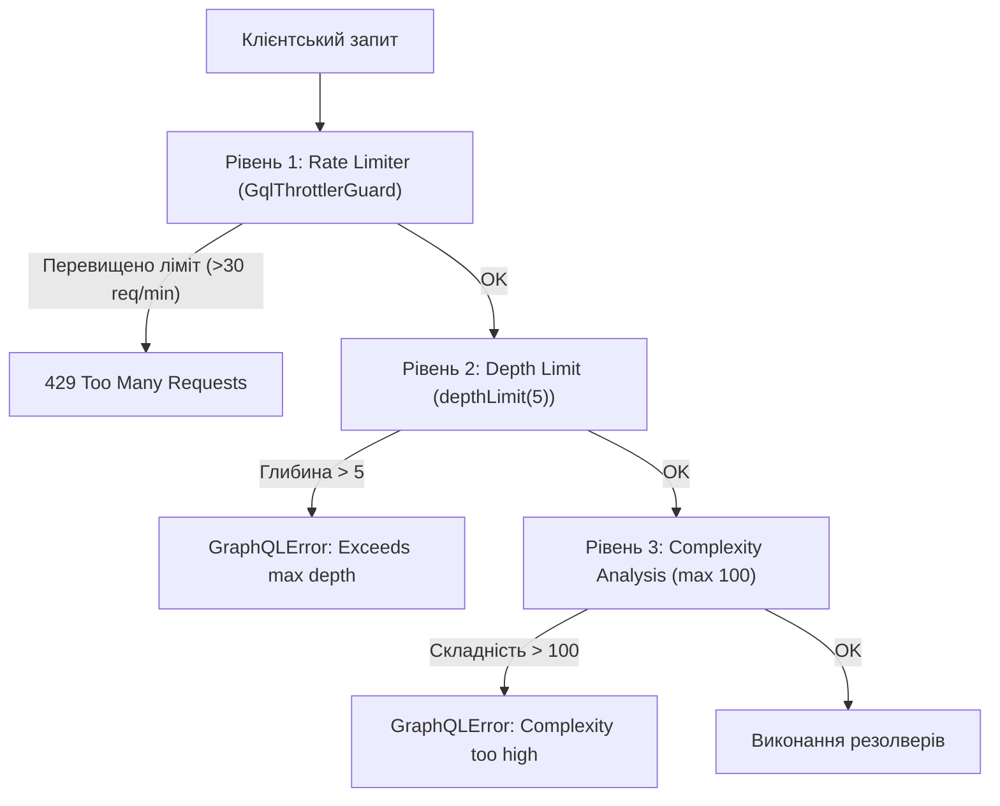

# 📋 Підсумок виконання: День 9 (Завдання 1 та Завдання 2)

## 📌 Загальний огляд

У рамках четвертого етапу (День 9) проєкту **InsightPulse Reporting Engine** було реалізовано комплексне інженерне рішення для оптимізації та безпеки **GraphQL API**:
1. **Подолання проблеми $N+1$ за допомогою DataLoader**: створено ізольовану фабрику request-scoped лоадерів для MongoDB, реалізовано пакетну вибірку (batching) та внутрішньозапитове кешування (memoization caching), що скоротило кількість запитів до бази даних у рази.
2. **Трирівневий захист GraphQL API від DoS-атак**:
   - **Query Depth Limiting**: обмеження глибини вкладеності рекурсивних запитів (`graphql-depth-limit`).
   - **Query Complexity Analysis**: статичний аналіз сумарної вартості полів запиту через плагін Apollo Server (`graphql-query-complexity`).
   - **Rate Limiting**: обмеження частоти запитів на рівні клієнтських IP через інтеграцію `@nestjs/throttler` та кастомний `GqlThrottlerGuard`.

---

## 🔗 Завдання 1: Усунення проблеми N+1 за допомогою DataLoader у NestJS

### Що реалізовано:

1. **Встановлення бібліотеки DataLoader**:
   - Додано пакет `dataloader` (із вбудованими типами TypeScript) для пакетування та мемоізації запитів у межах одного тику Event Loop.

2. **Створення фабрики лоадерів у [src/analytics/loaders/customer.loader.ts](../src/analytics/loaders/customer.loader.ts)**:
   - Створено клас `CustomerLoaderFactory`, заінжектовано модель Mongoose `Customer`.
   - **Врахування архітектури схеми**: оскільки поле `_id` у схемі `Customer` є рядком UUID (`string`), запит до MongoDB виконується безпосередньо через `{ _id: { $in: customerIds } }` без непотрібного кастингу до `ObjectId`.
   - **Гарантія контракту DataLoader**: база даних MongoDB через оператор `$in` не гарантує збереження початкового порядку записів. Для забезпечення суворої відповідності порядку та довжини масив результатів індексується через `Map<string, CustomerDocument>`, після чого формується результуючий масив строго за вхідними ключами:
     ```typescript
     const customerMap = new Map(customers.map((c) => [c._id.toString(), c]));
     return customerIds.map((id) => customerMap.get(id) ?? null);
     ```

3. **Request-scoped ізоляція у [src/app.module.ts](../src/app.module.ts)**:
   - Зареєстровано та експортовано `CustomerLoaderFactory` з `AnalyticsModule`.
   - `GraphQLModule` переведено на асинхронну ініціалізацію `forRootAsync<ApolloDriverConfig>()`.
   - У функції `context` на кожен вхідний HTTP-запит створюється новий екземпляр `DataLoader`:
     ```typescript
     context: ({ req, res }) => ({
       req,
       res,
       customerLoader: customerLoaderFactory.createLoader(),
     }),
     ```
   - **Чому це критично:** глобальний екземпляр (Singleton) призвів би до витоку пам'яті (пам'ять ніколи не очищується) та порушення ізоляції даних (користувач Б міг би отримати з кешу конфіденційні дані користувача А). Створення лоадера в `context` гарантує ізоляцію в межах одного HTTP-запиту.

4. **Опис моделей та оновлення схеми**:
   - Створено GraphQL ObjectType [src/analytics/models/customer.model.ts](../src/analytics/models/customer.model.ts) (`id`, `name`, `email`, `tier`).
   - У [src/analytics/models/category-report.model.ts](../src/analytics/models/category-report.model.ts) додано поле `topCustomerId?: string` (`{ nullable: true }`).
   - У пайплайн агрегації [src/analytics/analytics.service.ts](../src/analytics/analytics.service.ts) додано збереження `topCustomerId: { $first: '$customerId' }` у `$group` та `$project`.

5. **Реалізація пакетного резолвера у [src/analytics/analytics.resolver.ts](../src/analytics/analytics.resolver.ts)**:
   ```typescript
   @ResolveField(() => CustomerModel, { nullable: true })
   async topPerformerCustomer(
     @Parent() report: CategoryReport,
     @Context('customerLoader') customerLoader: CustomerDataLoader,
   ): Promise<CustomerModel | null> {
     if (!report.topCustomerId) return null;
     const customer = await customerLoader.load(report.topCustomerId);
     if (!customer) return null;
     return {
       id: customer._id,
       name: customer.name,
       email: customer.email,
       tier: customer.tier,
     };
   }
   ```

---

### 🔬 Експериментальне порівняння: З DataLoader та Без нього

Завдяки активованому `mongoose.set('debug', true)` у [src/main.ts](../src/main.ts) було на практиці зафіксовано різницю поведінки:

#### ❌ Варіант 1: Прямий виклик бази у резолвері (Класична проблема N+1)
```typescript
// topPerformerCustomer: await this.customerModel.findOne({ _id: report.topCustomerId })
```
Логи Mongoose у консолі:
```text
Mongoose: orderanalytics.aggregate([...])
Mongoose: customers.findOne({ _id: 'd45bde77-36d7-4c37-9273-32eab239b174' })
Mongoose: customers.findOne({ _id: '9da7bf0e-48ee-494f-9ec2-11ec81ebb36c' })
Mongoose: customers.findOne({ _id: '6a235b03-93df-448f-8fbc-dc4ea5b3c7d7' })
Mongoose: customers.findOne({ _id: 'f1670bc5-259c-4400-9050-fd5c0a20318a' })
```
> **Результат:** 1 агрегаційний запит + 4 індивідуальних запити до таблиці клієнтів = **5 звернень до бази даних**. Для 100 категорій це було б 101 звернення.

#### ✅ Варіант 2: Пакетний резолвер з DataLoader
```typescript
// topPerformerCustomer: await customerLoader.load(report.topCustomerId)
```
Логи Mongoose у консолі:
```text
Mongoose: orderanalytics.aggregate([...])
Mongoose: customers.find({ _id: { '$in': [ 'd45bde77-...', '9da7bf0e-...', '6a235b03-...', 'f1670bc5-...' ] } }, ...)
```
> **Результат:** 1 агрегаційний запит + **рівно 1 пакетний запит** `$in` для всіх знайдених клієнтів = **2 звернення до бази даних**. Проблему N+1 повністю нівельовано.

---

## 🛡️ Завдання 2: Захист GraphQL API від DoS-атак

Було побудовано надійну 3-рівневу систему безпеки для захисту сервісу від вичерпання процесорного часу, оперативної пам'яті та спам-трафіку:



### Що реалізовано:

### 1. Обмеження глибини запиту (Query Depth Limiting)
- **Пакет**: `graphql-depth-limit` та типи `@types/graphql-depth-limit`.
- **Конфігурація**: додано правило валідації `validationRules: [depthLimit(5)]` у [src/app.module.ts](../src/app.module.ts).
- **Механіка роботи**: Apollo Server аналізує вхідне AST-дерево запиту ще до старту виконання. Скалярні поля (листя) не збільшують глибину, а обчислюється кількість переходів між об'єктними блоками вибору (`selectionSet`). Перевірка строго більше `depthSoFar > maxDepth` миттєво відсікає рекурсивні та циклічні графи (наприклад, `category -> products -> category -> products...`).
- **Верифікація**: при тестовому ліміті `depthLimit(1)` трирівневий запит миттєво блокується з повідомленням `'TestDepth' exceeds maximum operation depth of 1`.

---

### 2. Аналіз складності запитів (Query Complexity Analysis)
- **Пакет**: `graphql-query-complexity`.
- **Конфігурація**: створено вбудований плагін Apollo Server у [src/app.module.ts](../src/app.module.ts).
- **Механіка роботи**: 
  - На етапі `didResolveOperation` плагін отримує скомпільовану схему з `requestDidStart({ schema })`.
  - Калькулятор обчислює вартість запиту на базі оцінювачів: `simpleEstimator({ defaultComplexity: 1 })` призначає кожному полю 1 бал, а `fieldExtensionsEstimator()` враховує кастомні складності.
  - Якщо сумарна складність перевищує поріг `maxComplexity = 100`, запит відхиляється через `GraphQLError`.
- **Захист від горизонтальних DoS-атак**: навіть якщо запит має невелику глибину (наприклад, 2 рівні), спроба запросити сотні дублікатів полів через GraphQL-аліаси блокується до звернення до бази.

---

### 3. Rate Limiting через Throttler
- **Пакет**: `@nestjs/throttler`.
- **Вирішення проблеми версійності NestJS 12 у [package.json](../package.json)**:
  Оскільки `@nestjs/throttler@6.5` декларував `peerDependencies` до NestJS 11, було додано блок `overrides` для примусової сумісності з NestJS 12:
  ```json
  "overrides": {
    "//": "Fix peerDependency conflict: @nestjs/throttler@6.5 expects @nestjs/common ^11, but project uses NestJS 12",
    "@nestjs/throttler": {
      "@nestjs/common": "$@nestjs/common",
      "@nestjs/core": "$@nestjs/core"
    }
  }
  ```
- **Кастомний гвард [src/analytics/guards/gql-throttler.guard.ts](../src/analytics/guards/gql-throttler.guard.ts)**:
  GraphQL працює поверх єдиного маршруту `/graphql`. Щоб отримати клієнтські об'єкти `req` та `res` (і IP-адресу клієнта), гвард адаптує контекст:
  ```typescript
  @Injectable()
  export class GqlThrottlerGuard extends ThrottlerGuard {
    getRequestResponse(context: ExecutionContext) {
      const gqlCtx = GqlExecutionContext.create(context);
      const ctx = gqlCtx.getContext();
      return { req: ctx.req, res: ctx.res };
    }
  }
  ```
- **Конфігурація**: 
  - У `app.module.ts`: `ThrottlerModule.forRoot([{ ttl: 60000, limit: 30 }])` (максимум 30 запитів на хвилину).
  - У `analytics.resolver.ts`: активовано `@UseGuards(GqlThrottlerGuard)` над кореневим методом `@Query()`.
- **Верифікація**: тестовий запуск 5 швидких запитів підряд при ліміті 3 продемонстрував, що перші 3 запити повертають `200 OK`, а 4-й та 5-й повертають `ThrottlerException: Too Many Requests`.

---

## ❓ Відповіді на контрольні запитання Дня 9

1. **Чому `DataLoader` вимагає, щоб повернутий масив мав строго таку ж довжину і такий самий порядок елементів, як і вхідний масив ключів?**
   - Метод `loader.load(key)` повертає окремий `Promise` для кожного індивідуального ключа.
   - Коли батч-функція повертає масив значень, внутрішній механізм `DataLoader` зіставляє `keys[i]` з `values[i]` за **індексом масиву** (`0, 1, 2, ...`).
   - Якщо база даних поверне масив меншої довжини або в іншому порядку (як це за замовчуванням робить MongoDB `$in`), DataLoader помилково прив'яже документ клієнта Б до промісу клієнта А. Використання `Map` гарантує, що для кожного вхідного ключа повернеться відповідний об'єкт або `null`.

2. **Чому життєвий цикл екземпляра `DataLoader` повинен бути per-request (створюватися у функції `context`), а не глобальним Singleton у NestJS?**
   - `DataLoader` має внутрішній кеш мемоізації (`this._cache`).
   - Якщо зробити екземпляр глобальним Singleton:
     1. **Витік пам'яті (Memory Leak)**: усі завантажені сутності за всю історію роботи сервера залишатимуться в оперативній пам'яті процесу Node.js.
     2. **Витік конфіденційних даних**: користувач Б може отримати закешовані дані користувача А, якщо їхні запити збігаються за ID.
     3. **Проблема неактуальних даних (Stale Data)**: зміни, внесені в базу в рамках нового запиту, не відображатимуться, оскільки лоадер повертатиме застарілий кеш.
   - Створення нового лоадера в `context` обмежує час життя кешу рамками одного HTTP-запиту, що усуває всі три ризики.

3. **Чому обмеження глибини (Depth Limit) недостатньо для повного захисту і потрібен Query Complexity Analysis?**
   - Depth Limit контролює лише **вертикальний** вимір запиту (скільки разів відкрито фігурні дужки `{}`).
   - Зловмисник може надіслати **горизонтальний запит** з глибиною лише 2 або 3, але використовуючи аліаси (`alias1: categoryReports`, `alias2: categoryReports`, ...), повторити важкий запит 50 разів в одному документі.
   - Depth Limit пропустить такий запит, тоді як Query Complexity підсумує бали кожного поля і заблокує його.

4. **Чому стандартний `ThrottlerGuard` від NestJS не працює для GraphQL «з коробки»?**
   - У стандартному NestJS REST-додатку контекст виконання `ExecutionContext` надає HTTP-об'єкти через `context.switchToHttp().getRequest()`.
   - У GraphQL взаємодія відбувається через Apollo Server, де HTTP `req` та `res` знаходяться всередині об'єкта `context`, сформованого модулем `GraphQLModule`.
   - Адаптер `GqlExecutionContext.create(context).getContext()` дає змогу витягти оригінальні `req` і `res` для коректного визначення IP-адреси клієнта.

---

## 📊 Зведена таблиця реалізованих засобів оптимізації та захисту

| Засіб | Пакет / Інструмент | Цільова загроза / Проблема | Рівень застосування |
| :--- | :--- | :--- | :--- |
| **DataLoader** | `dataloader` | Проблема $N+1$ запитів, затримка I/O бази | Резолвер (`@ResolveField`) |
| **Request-scoped Context** | `@nestjs/graphql` | Витік пам'яті, змішування кешу користувачів | Конфігурація `context` Apollo |
| **Query Depth Limiting** | `graphql-depth-limit` | Рекурсивні цикли, Stack Overflow, OOM DoS | Apollo `validationRules` |
| **Complexity Analysis** | `graphql-query-complexity` | Горизонтальне перевантаження CPU важкими запитами | Apollo Server `plugins` |
| **Rate Limiting (Throttler)**| `@nestjs/throttler` | Brute-force атаки, спам запитами на `/graphql` | NestJS Guard (`@UseGuards`) |
